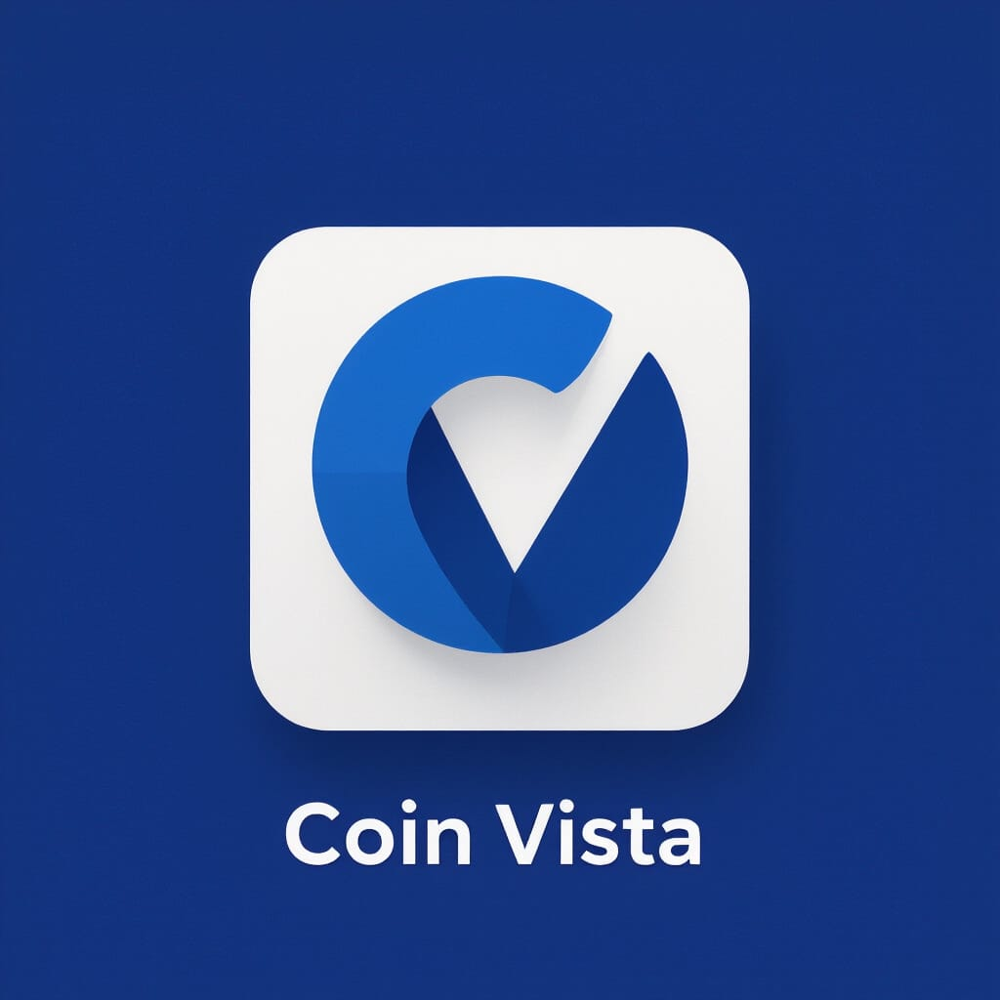

<div align="center">



**Vision powered by data.**

A modern Android app for cryptocurrency market data, built with Kotlin, Jetpack Compose and a clean multi-module architecture.

[](https://kotlinlang.org)
[](https://developer.android.com/develop/ui/compose)
[](https://developer.android.com)
[](LICENSE)

</div>

## Overview

CoinVista delivers real-time cryptocurrency prices, crypto news and portfolio tracking through a fast, responsive, Material 3 UI. It is organized as a multi-module project with shared Gradle convention plugins and a custom annotation-based navigation router.

## Features

- 📈 **Markets** — live prices, market data and charts
- 📰 **News** — curated cryptocurrency news feed
- 💼 **Portfolio** — track your holdings and positions
- 👤 **Mine** — personal center
- 🔍 **Search** — search across the market
- 🌐 **In-app browser** — open linked content in a built-in WebView

## Tech Stack

| Category     | Technology                                                                 |
| ------------ | -------------------------------------------------------------------------- |
| Language     | Kotlin 2.4.0                                                               |
| UI           | Jetpack Compose + Material 3                                                |
| Architecture | MVVM, `StateFlow`, Repository pattern                                       |
| DI           | [Koin](https://insert-koin.io) 4.2 + Koin Compiler Plugin                  |
| Navigation   | Custom annotation-based router (`@Screen` + KSP codegen)                    |
| Network      | Retrofit 3, OkHttp 5, kotlinx.serialization                                 |
| Realtime     | [Scarlet](https://github.com/Tinder/Scarlet) (WebSocket)                    |
| Image        | [Coil](https://coil-kt.github.io/coil) 3                                     |
| Storage      | MMKV, Room, DataStore                                                       |
| Build        | Gradle Kotlin DSL + convention plugins (`build-logic`)                      |

## Architecture

The project follows a layered, multi-module structure:

```
CoinVista/
├── app/            # Application, MainActivity, Koin + navigation bootstrap
├── build-logic/    # Convention plugins (shared Gradle config)
├── core/           # Reusable infrastructure (no business logic)
│   ├── analytics/  #   Analytics tracking
│   ├── common/     #   Base ViewModels, Result wrappers
│   ├── data/       #   Repositories + global AppState
│   ├── database/   #   Room database
│   ├── datastore/  #   DataStore preferences
│   ├── design/     #   Design system (theme, colors, typography)
│   ├── model/      #   Data models (request/response)
│   ├── network/    #   Retrofit / OkHttp / Scarlet WebSocket
│   ├── ui/         #   Reusable Compose components
│   └── util/       #   Utility functions
└── feature/        # Feature modules (UI + ViewModels)
    ├── main/       #   Main screen (bottom nav: Markets/News/Portfolio/Mine)
    ├── market/     #   Market & search
    ├── auth/       #   Authentication (stub)
    └── common/     #   Shared features (WebView, etc.)
```

### Key design decisions

- **Navigation** uses a custom annotation-based router: annotate a `@Composable` with `@Screen(route = "...")`, and a KSP processor generates route destinations and per-module `init*()` initializers, driven by the `NavCenter` singleton.
- **Dependency injection** is centralized per module under a `dl/` package (`networkModule`, `mainModule`, `marketModule`, …) and started once in `Application.onCreate()`.
- **Networking** follows a repository pattern: `*NetworkDataSource` interfaces + `*NetworkDataSourceImpl` implementations, injected via Koin `single<Impl>() bind Interface::class`.
- **State management** exposes UI state through `StateFlow`, with shared base classes (`BaseViewModel`, `BaseNetWorkViewModel`, `BaseNetWorkListViewModel`) and a unified `ResultHandler` + `asResult()` pipeline.

## Getting Started

### Prerequisites

- **JDK 17**
- **Android SDK 36** (compile/target), min SDK 26
- A **CoinStats API key** ([coinstats.app](https://coinstats.app))

### Configure

Add your API key to `local.properties`:

```properties
COINSTATS_API_KEY=your_api_key_here
```

> **Note:** the navigation router (`com.yiqun.nav`) is hosted on a private GitLab Maven repository configured in `settings.gradle.kts`. Building this project requires access to that repository.

### Build

```bash
# Build a debug APK
./gradlew assembleDebug

# Install on a connected device
./gradlew installDebug

# Build only the app module
./gradlew :app:assembleDebug
```

### Test

```bash
# Run all unit tests
./gradlew test

# Run a single module's tests
./gradlew :core:common:test

# Instrumented tests on a connected device
./gradlew connectedDebugAndroidTest
```

### Lint

```bash
./gradlew lint
```

## License

This project is licensed under the [MIT License](LICENSE).

Copyright (c) 2025 达令哥
